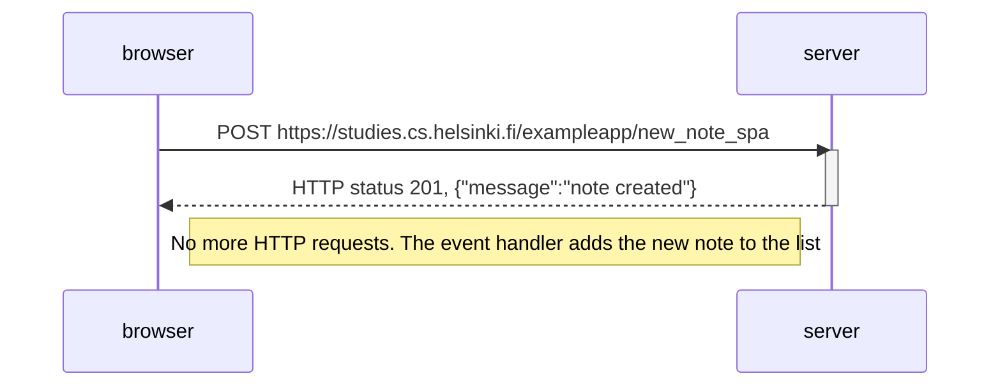

```mermaid
sequenceDiagram
    participant browser
    participant server

    browser->>server: POST https://studies.cs.helsinki.fi/exampleapp/new_note_spa
    activate server
    server-->>browser: HTTP status 201, {"message":"note created"}
    deactivate server


    Note right of browser: No more HTTP requests. The event handler adds the new note to the list
```